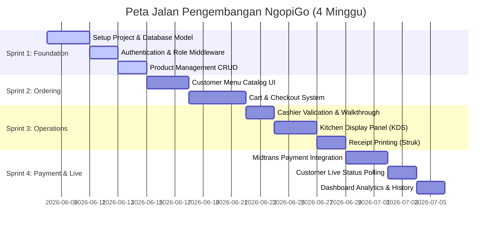
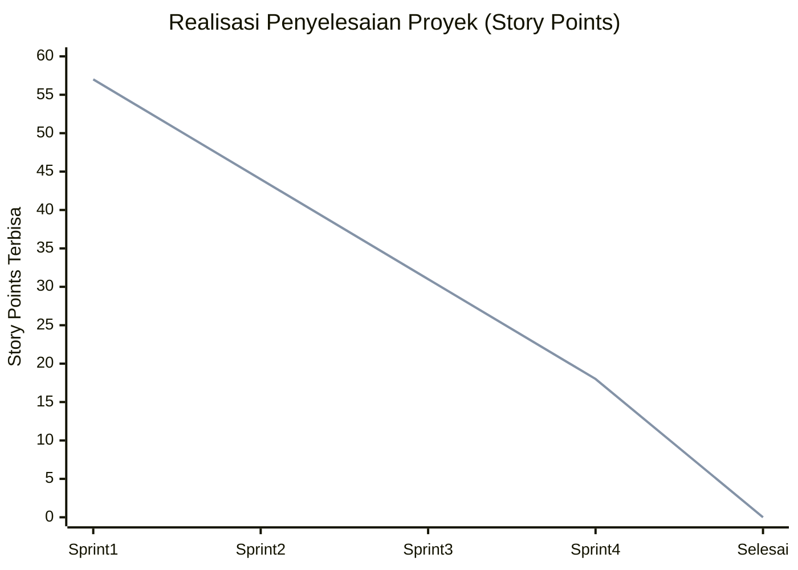

# 📋 Dokumen Sprint Backlog - NgopiGo

Dokumen ini berisi pencatatan **Product Backlog** dan pembagian **Sprint Backlog** untuk pengembangan **NgopiGo**, sebuah Sistem Pemesanan Restoran & Kafe berbasis Laravel 13. Pengembangan disimulasikan dan dibagi menjadi **4 Sprint** dengan durasi masing-masing **1 minggu (7 hari)**.

---

## 👥 Tim Scrum & Parameter Proyek
* **Metodologi**: Scrum (Agile)
* **Durasi Proyek**: 4 Minggu (4 Sprint)
* **Durasi Per Sprint**: 1 Minggu (7 Hari Kalender)
* **Skala Estimasi**: Story Points (Fibonacci: 1, 2, 3, 5, 8)
* **Status Proyek saat ini**: **Selesai (Completed)** (Diabadikan untuk kebutuhan dokumentasi)

---

## 🗺️ Peta Jalan Pengembangan (Roadmap Proyek)

---

## 🗂️ Product Backlog Item (PBI) Master List

Berikut adalah daftar utama Product Backlog yang dirancang dan diimplementasikan untuk NgopiGo:

| ID PBI | Nama Backlog / Fitur | Deskripsi Singkat | User Story | Story Points | Prioritas | Target Sprint |
| :--- | :--- | :--- | :--- | :---: | :---: | :---: |
| **PBI-01** | Project & DB Core Init | Inisialisasi framework Laravel, database SQLite/MySQL, migrasi awal, serta model dasar (`User`, `Admin`, `Product`). | *Sebagai developer, saya ingin menginisialisasi basis kode agar memiliki arsitektur database yang solid.* | **3** | High | Sprint 1 |
| **PBI-02** | Authentication & Roles | Implementasi sistem login/logout untuk Admin, Kasir, dan Dapur dengan middleware hak akses. | *Sebagai staf operasional, saya ingin masuk dengan akun yang memiliki hak akses sesuai tugas saya.* | **5** | High | Sprint 1 |
| **PBI-03** | Product Catalog CRUD | CRUD menu makanan/minuman, pengelolaan harga coret/diskon, manajemen stok/ketersediaan, dan upload gambar menu. | *Sebagai Admin/Manager, saya ingin mengelola katalog menu agar pelanggan melihat menu terbaru.* | **5** | Medium | Sprint 1 |
| **PBI-04** | Menu Catalog (Customer) | Tampilan katalog menu yang responsif, dikelompokkan berdasarkan kategori (Kopi, Non-kopi, Makanan, Cemilan). | *Sebagai pelanggan, saya ingin melihat menu kafe lewat browser HP saya dengan tampilan menarik.* | **5** | High | Sprint 2 |
| **PBI-05** | Cart & Order Checkout | Mesin keranjang belanja (cart) lokal, pengisian nomor meja, nama pelanggan, no telepon, catatan, dan proses simpan pesanan. | *Sebagai pelanggan, saya ingin memilih beberapa menu dan memesan langsung dari meja.* | **8** | High | Sprint 2 |
| **PBI-06** | Cashier Payment Scan | Fitur Kasir memvalidasi pembayaran COD/Cash dengan men-scan QR code di HP pelanggan dan mengubah status ke `PAID`. | *Sebagai Kasir, saya ingin mencocokkan pesanan pelanggan dan mengonfirmasi pembayaran dengan cepat.* | **5** | High | Sprint 3 |
| **PBI-07** | Manual Order (Walkthrough) | Fitur kasir membuat pesanan langsung untuk pelanggan walk-in lewat dashboard kasir. | *Sebagai Kasir, saya ingin melayani pesanan pelanggan yang memesan langsung di meja kasir.* | **5** | Medium | Sprint 3 |
| **PBI-08** | Kitchen Display Panel | Layar khusus dapur (KDS) yang menampilkan pesanan lunas secara real-time dan kontrol transisi status (`Preparing`, `Ready`, `Completed`). | *Sebagai staf Dapur, saya ingin melihat pesanan yang harus dibuat agar proses memasak terorganisir.* | **5** | High | Sprint 3 |
| **PBI-09** | Print Receipt (Struk) | Pembuatan struk belanja digital yang ramah pencetakan printer thermal untuk pesanan yang telah dikonfirmasi. | *Sebagai Kasir/Pelanggan, saya ingin mencetak struk belanja sebagai bukti transaksi fisik.* | **3** | Low | Sprint 3 |
| **PBI-10** | Midtrans Payment | Integrasi dengan Midtrans Sandbox, Snap Token generation, dan webhook callback untuk auto-update payment status ke `PAID`. | *Sebagai pelanggan, saya ingin membayar secara online menggunakan QRIS/e-wallet untuk kepraktisan.* | **8** | High | Sprint 4 |
| **PBI-11** | Live Order Tracking | Halaman pemantauan pesanan pelanggan yang memantau perubahan status pesanan secara real-time via AJAX Polling. | *Sebagai pelanggan, saya ingin memantau status pembuatan pesanan saya dari meja tanpa harus ke dapur.* | **5** | Medium | Sprint 4 |
| **PBI-12** | Analytics & History Log | Laporan penjualan harian/bulanan di dashboard admin serta riwayat lengkap pesanan selesai/dibatalkan. | *Sebagai Admin/Manager, saya ingin melihat statistik penjualan untuk memantau performa kafe.* | **5** | Medium | Sprint 4 |

---

## 🏃 Detail Pembagian Sprint Backlog

---

### 📅 SPRINT 1: Foundation, Authentication, & Menu Management
* **Durasi**: 7 Hari (Minggu ke-1)
* **Fokus Sprint**: Membangun fondasi sistem, sistem autentikasi multi-role (Admin, Kasir, Dapur), dan manajemen katalog menu.
* **Target Velocity**: 13 Story Points

#### 📋 Sprint Backlog Items (Sprint 1)
1. **[PBI-01] Project Init & Database Core** (3 SP)
   * **Tugas**:
     * Inisialisasi Laravel 13 & Git repository.
     * Membuat database SQLite (`database/database.sqlite`) dan mengonfigurasi `.env`.
     * Membuat migrasi dasar: `users`, `admins`, dan `products`.
     * Membuat model Eloquent `User`, `Admin`, dan `Product` beserta relasinya.
     * Membuat `AdminSeeder` dan `ProductSeeder` untuk menyuntikkan data uji awal.
   * **Status**: `[x] Selesai`
2. **[PBI-02] Authentication & Multi-Role Middleware** (5 SP)
   * **Tugas**:
     * Membuat sistem login/logout terproteksi di rute `/admin/login`.
     * Menambahkan kolom `role` pada tabel admins (`admin`, `cashier`, `kitchen`).
     * Membuat middleware kustom `RoleMiddleware` untuk validasi akses rute.
     * Menyusun rute admin grup di `routes/web.php` dengan perlindungan auth garda ganda.
   * **Status**: `[x] Selesai`
3. **[PBI-03] Admin Product Catalog CRUD** (5 SP)
   * **Tugas**:
     * Membuat `ProductController` untuk operasi CRUD menu kafe.
     * Mendesain UI form tambah/edit menu dengan field: nama, kategori, deskripsi, harga, diskon, ketersediaan, dan upload gambar.
     * Menambahkan validasi form input produk di sisi server.
     * Menambahkan logika pembersihan file gambar lama saat produk dihapus/diedit.
   * **Status**: `[x] Selesai`

#### 🛠️ Komponen Kode yang Terlibat (Sprint 1)
* **Model**: [Admin.php](file:///c:/laragon/www/ngopi-go/app/Models/Admin.php), [Product.php](file:///c:/laragon/www/ngopi-go/app/Models/Product.php)
* **Controller**: [ProductController.php](file:///c:/laragon/www/ngopi-go/app/Http/Controllers/Admin/ProductController.php), [AuthController.php](file:///c:/laragon/www/ngopi-go/app/Http/Controllers/Admin/AuthController.php)
* **Seeders**: [AdminSeeder.php](file:///c:/laragon/www/ngopi-go/database/seeders/AdminSeeder.php), [ProductSeeder.php](file:///c:/laragon/www/ngopi-go/database/seeders/ProductSeeder.php)
* **Views**: `resources/views/admin/auth/login.blade.php`, `resources/views/admin/products/index.blade.php`, `resources/views/admin/products/create.blade.php`

---

### 📅 SPRINT 2: Customer Front-End Catalog & Order Creation
* **Durasi**: 7 Hari (Minggu ke-2)
* **Fokus Sprint**: Mengembangkan halaman pelanggan agar bisa memindai QR meja, melihat menu secara responsif, mengelola keranjang, dan melakukan checkout.
* **Target Velocity**: 13 Story Points

#### 📋 Sprint Backlog Items (Sprint 2)
1. **[PBI-04] Responsive Menu Catalog UI for Customer** (5 SP)
   * **Tugas**:
     * Membuat layout customer `/pesan/{tableNumber}` yang responsif (mobile-first).
     * Implementasi filter menu berdasarkan Kategori (Coffee, Non-Coffee, Food, Snacks) dengan Javascript tab dinamis.
     * Mendesain kartu menu (Product Card) elegan dengan visualisasi gambar, indikator stok, dan penanda harga diskon.
     * Menggunakan font premium (Inter/Outfit) dan skema warna dark mode mewah khas "NgopiGo".
   * **Status**: `[x] Selesai`
2. **[PBI-05] Shopping Cart & Order Checkout System** (8 SP)
   * **Tugas**:
     * Membuat logic Cart di sisi klien menggunakan Javascript (menyimpan ke local storage atau variabel state).
     * Membuat modal checkout yang dinamis berisi input: Nama Pelanggan, No Telepon, Pilihan Pembayaran (COD / QRIS), Catatan, dan ringkasan subtotal.
     * Membuat migrasi database `orders` dan `order_items` beserta relasinya.
     * Membuat logic penyimpanan data pesanan di `OrderController@store`.
     * Menerapkan validasi stok/ketersediaan sebelum pesanan diproses di backend.
     * Mengarahkan pelanggan ke halaman sukses order `/pesanan/{orderNumber}`.
   * **Status**: `[x] Selesai`

#### 🛠️ Komponen Kode yang Terlibat (Sprint 2)
* **Model**: [Order.php](file:///c:/laragon/www/ngopi-go/app/Models/Order.php), [OrderItem.php](file:///c:/laragon/www/ngopi-go/app/Models/OrderItem.php)
* **Controller**: [OrderController.php](file:///c:/laragon/www/ngopi-go/app/Http/Controllers/OrderController.php)
* **Views**: [order.blade.php](file:///c:/laragon/www/ngopi-go/resources/views/customer/order.blade.php) (tampilan katalog dan cart terintegrasi), `resources/views/customer/success.blade.php`

---

### 📅 SPRINT 3: Operations (Cashier Panel, Kitchen Display, & Printing)
* **Durasi**: 7 Hari (Minggu ke-3)
* **Fokus Sprint**: Mengembangkan fitur-fitur operasional internal kafe untuk memperlancar koordinasi antara kasir, dapur, dan pelanggan.
* **Target Velocity**: 13 Story Points

#### 📋 Sprint Backlog Items (Sprint 3)
1. **[PBI-06] Cashier Scan & Confirmation Dashboard** (5 SP)
   * **Tugas**:
     * Membuat fitur scan/lihat pesanan berdasarkan kode order unik `ORD-{table}-{queue}`.
     * Mendesain tombol konfirmasi pembayaran di halaman kasir `/admin/orders/{id}/payment` untuk pembayaran tunai/COD.
     * Mengubah status pesanan dari `PENDING` menjadi `PAID` setelah kasir menekan konfirmasi bayar.
   * **Status**: `[x] Selesai`
2. **[PBI-07] Manual Walkthrough Order for Cashier** (5 SP)
   * **Tugas**:
     * Membuat rute `/admin/walkthrough` khusus kasir untuk menginput pesanan pelanggan secara manual jika ada antrean kasir langsung.
     * Menggunakan layout pemesanan cepat dengan pencarian menu kilat bagi kasir.
   * **Status**: `[x] Selesai`
3. **[PBI-08] Kitchen Display System (KDS) Panel** (5 SP)
   * **Tugas**:
     * Membuat tampilan khusus dapur di `/admin/kitchen`.
     * Menyaring pesanan agar hanya menampilkan pesanan yang sudah `PAID` (baik online maupun COD yang sudah divalidasi kasir).
     * Menyediakan tombol transisi status pesanan yang intuitif untuk dapur:
       * `PAID` ➔ `PREPARING` (Pesanan disiapkan)
       * `PREPARING` ➔ `READY` (Pesanan siap diambil/disajikan)
       * `READY` ➔ `COMPLETED` (Pesanan selesai diambil oleh kasir/pelanggan)
   * **Status**: `[x] Selesai`
4. **[PBI-09] Thermal Receipt Printing Generator** (3 SP)
   * **Tugas**:
     * Membuat layout struk pembayaran minimalis ramah printer thermal 58mm/80mm di `/admin/orders/{id}/receipt`.
     * Menambahkan fitur cetak langsung via shortcut `window.print()` browser.
     * Menyertakan informasi nomor meja, nama pelanggan, waktu, rincian menu, catatan, metode bayar, dan total harga.
   * **Status**: `[x] Selesai`

#### 🛠️ Komponen Kode yang Terlibat (Sprint 3)
* **Controller**: [OrderController.php](file:///c:/laragon/www/ngopi-go/app/Http/Controllers/OrderController.php) (logika kasir & kitchen)
* **Views**:
   * Dapur: `resources/views/admin/orders/kitchen.blade.php`
   * Kasir: `resources/views/admin/orders/index.blade.php`, `resources/views/admin/orders/edit.blade.php`, `resources/views/admin/orders/receipt.blade.php`
   * Walkthrough: `resources/views/admin/orders/walkthrough.blade.php`

---

### 📅 SPRINT 4: Payment Gateway, Real-Time Tracker, & Analytics
* **Durasi**: 7 Hari (Minggu ke-4)
* **Fokus Sprint**: Mengintegrasikan gerbang pembayaran online, membangun fitur monitoring live pelanggan, serta analytics dashboard bagi admin.
* **Target Velocity**: 18 Story Points

#### 📋 Sprint Backlog Items (Sprint 4)
1. **[PBI-10] Midtrans Payment Gateway Integration** (8 SP)
   * **Tugas**:
     * Mengunduh & mengonfigurasi Midtrans PHP SDK via Composer (`midtrans/midtrans-php`).
     * Menghubungkan kredensial Sandbox Client Key & Server Key ke berkas `.env`.
     * Menambahkan logika pembuatan Midtrans Snap Token saat checkout pesanan bertipe online di `OrderController@store`.
     * Menyiapkan endpoint `/midtrans/callback` untuk menangkap webhook notifikasi transaksi dari Midtrans.
     * Menangani validasi signature key dan pembaruan otomatis status pesanan menjadi `PAID` atau `CANCELLED`.
   * **Status**: `[x] Selesai`
2. **[PBI-11] Customer Live Status Tracker (AJAX Polling)** (5 SP)
   * **Tugas**:
     * Menambahkan AJAX polling interval 5 detik di halaman sukses order pelanggan `/pesanan/{orderNumber}`.
     * Membuat endpoint `/pesanan/{orderNumber}/status-bayar` untuk mengembalikan format JSON status pembayaran terbaru.
     * Mendesain status bar dinamis di UI pelanggan untuk menampilkan status: `Pending` ➔ `Paid` ➔ `Preparing` ➔ `Ready` ➔ `Completed`.
     * Menambahkan efek micro-animation dan audio sound-effect pendek saat status berubah menjadi `READY`.
   * **Status**: `[x] Selesai`
3. **[PBI-12] Admin Analytics Dashboard & History Logs** (5 SP)
   * **Tugas**:
     * Membuat halaman beranda admin `/admin` dengan visualisasi diagram performa kafe.
     * Menampilkan metrik: Total Penjualan Hari Ini, Jumlah Pesanan Aktif, Pesanan Dapur Terbuka, dan Menu Terlaris.
     * Membuat riwayat pesanan `/admin/history` dengan fitur filter rentang tanggal dan pencarian.
   * **Status**: `[x] Selesai`

#### 🛠️ Komponen Kode yang Terlibat (Sprint 4)
* **Controller**: [DashboardController.php](file:///c:/laragon/www/ngopi-go/app/Http/Controllers/Admin/DashboardController.php), [OrderController.php](file:///c:/laragon/www/ngopi-go/app/Http/Controllers/OrderController.php)
* **Views**:
   * Dashboard: `resources/views/admin/dashboard.blade.php`
   * Riwayat: `resources/views/admin/orders/history.blade.php`
   * Customer: `resources/views/customer/success.blade.php`
* **Config**: `config/midtrans.php`

---

## 📊 Statistik & Metrik Proyek

### 📈 Grafik Burndown Sprint (Ideal vs Realisasi)

### 📋 Ringkasan Alokasi Story Points
* **Sprint 1 (Foundation)**: 13 Story Points (3 PBI)
* **Sprint 2 (Ordering)**: 13 Story Points (2 PBI)
* **Sprint 3 (Operations)**: 18 Story Points (4 PBI)
* **Sprint 4 (Payment & Track)**: 18 Story Points (3 PBI)
* **Total Proyek**: **62 Story Points** (12 PBI selesai)

---

> [!NOTE]
> Seluruh sprint backlog di atas telah diuji dan divalidasi sesuai dengan kondisi *source code* aktif pada sistem **NgopiGo**. Seluruh fitur operasional dari antarmuka pelanggan, kasir, dapur, hingga webhook callback Midtrans telah terimplementasi dengan baik dan siap digunakan dalam dokumentasi laporan akhir proyek.
